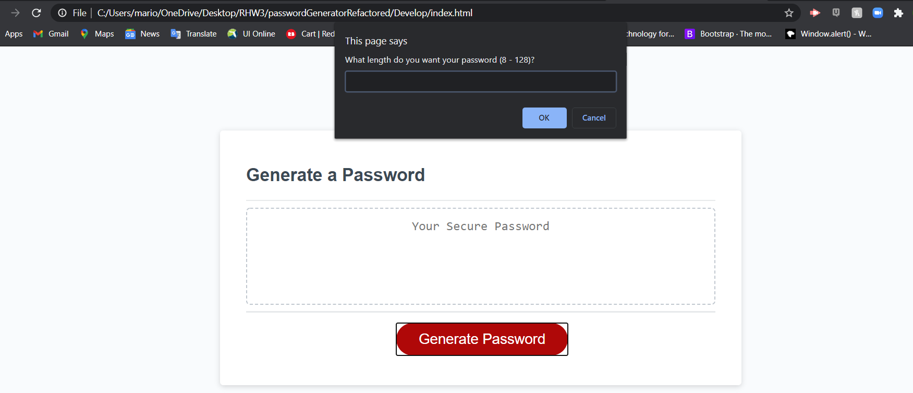
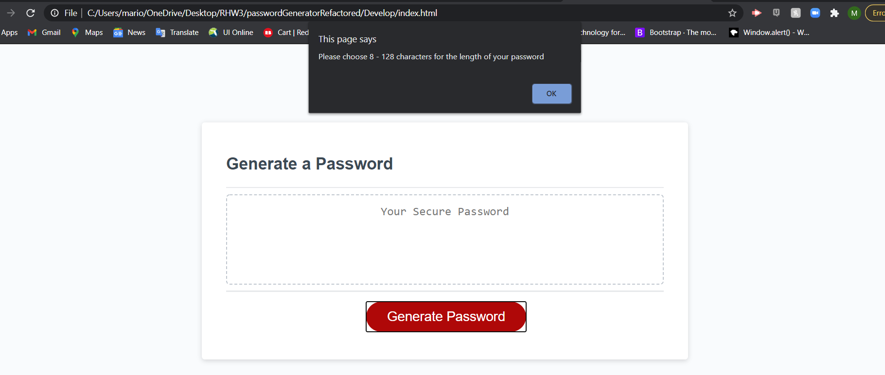
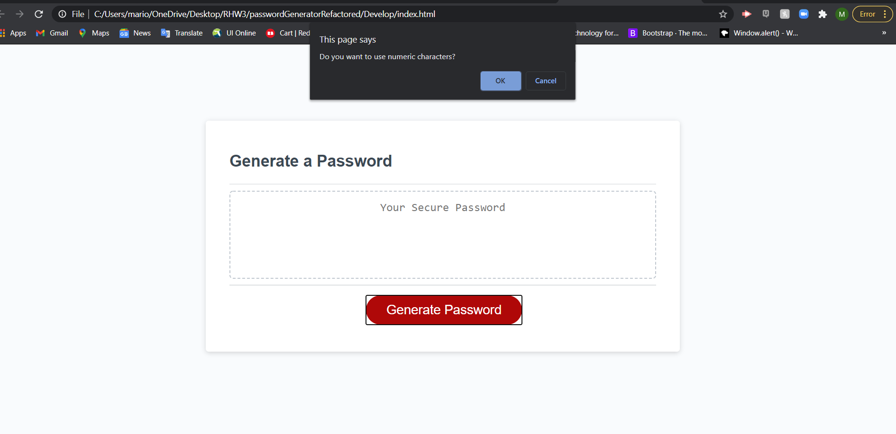
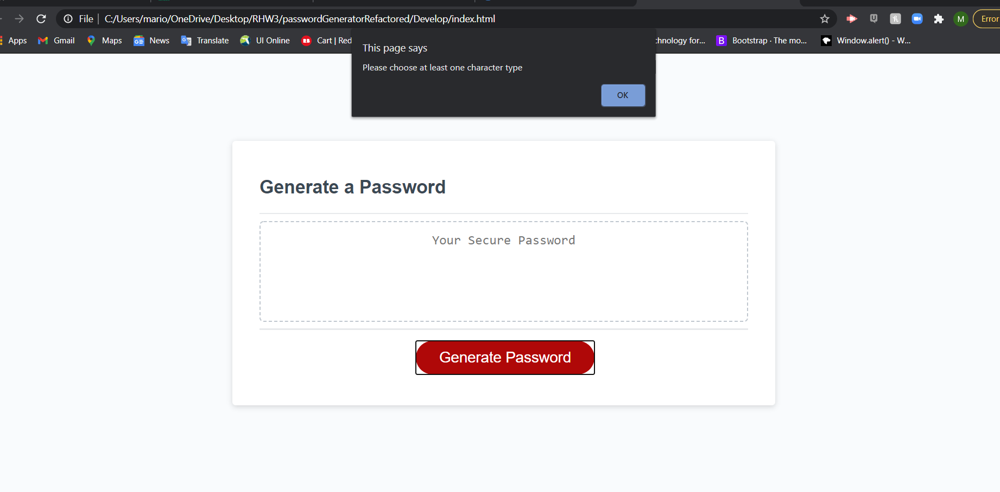

# passwordGeneratorRefactored

### Refactored Code

## HTML & CSS File

Added comments to the files.

## JS File

Created functionality to the Password Generator application. I added prompts to ask the user how long and what character types they wanted included into password being generated. I added code to validate that the user ask for a length between 8 -128 and choose at least 1 character type. I added variables that stored user input and functions that choose values depending on the input received from user. I added a function that returns the values chosen to the user.

## Languages

HTML, CSS and Javascript

## Screenshots

## Link For Deployed Application

[Password Generator URL](https://lavina91.github.io/passwordGeneratorRefactored/)
